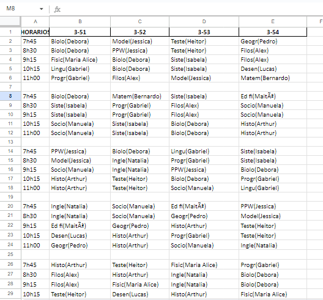

# ScheduleGen API

* O ScheduleGen é uma API criada para trabalhar em conjunto com a aplicação web <a href="https://github.com/KevinGirelli/estudante-mais">Estudante+</a>

 

* O **Estudante+** foi desenvolvido por mim e pelo <a href="https://github.com/KevinGirelli">Kevin Girelli</a> , como um trabalho de conclusão de curso.

#### Oque é?
O ScheduleGen é uma API simples que gerá horários escolares.

Ele cria horários de periodo integral ou meio período, fornecendo a programação das aulas para os cinco dias da semana. Gerando o horário para todas as turmas requiridas com base nos professores que lecionam para as turmas.

#### Como gerar horários?
O usúario fornece dados em um arquivo JSON com os paramêtros para a geração. Dentro destes parametros incluem:

* Quantidade de turmas

* Tipo de geração(Meio período ou integral)

* Os professores que irão lecionar e a quantidade de aulas semanais para suas disciplinas.

* Limite máximo de aulas consecutivas

#### Pós geração

Após a geração, é criado uma planilha em Excel, onde é possivel visualizar a tabela do horário gerado.
Localizado na pasta(scheduleResponse)

## Bibliotecas utilizadas

* Pandas
* Openpyxl
* Flask(API)

## Arquivo excel gerado

